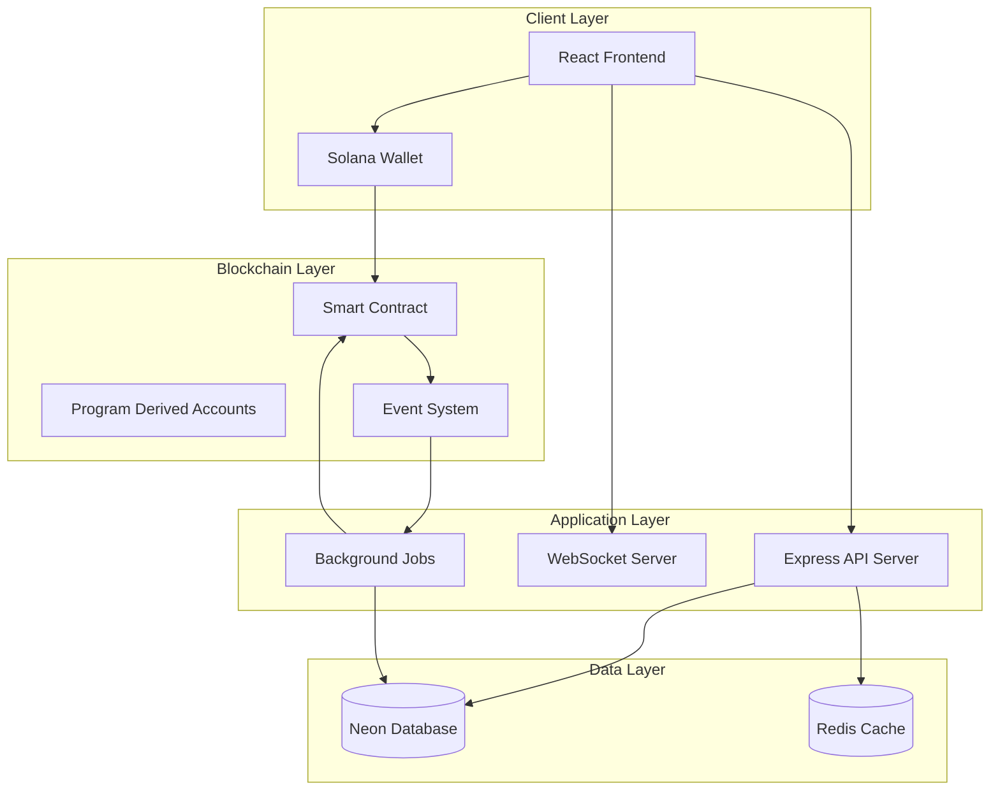

# Fair Coin Flipper - System Design

## Architecture Design

### High-Level System Architecture



## Component Design

### 1. Smart Contract Design

#### Core Functions
```rust
// Game Management
pub fn create_game(ctx: Context<CreateGame>, game_id: u64, bet_amount: u64) -> Result<()>
pub fn join_game(ctx: Context<JoinGame>) -> Result<()>

// Commitment Phase
pub fn make_commitment(ctx: Context<MakeCommitment>, commitment: [u8; 32]) -> Result<()>

// Reveal Phase
pub fn reveal_choice(ctx: Context<RevealChoice>, choice: CoinSide, secret: u64) -> Result<()>
```

#### Account Structure
```rust
#[account]
pub struct Game {
    pub game_id: u64,
    pub player_a: Pubkey,
    pub player_b: Pubkey,
    pub bet_amount: u64,
    pub house_wallet: Pubkey,
    
    // Security: Cryptographic commitments
    pub commitment_a: [u8; 32],
    pub commitment_b: [u8; 32],
    pub commitments_complete: bool,
    
    // Game resolution
    pub status: GameStatus,
    pub coin_result: Option<CoinSide>,
    pub winner: Option<Pubkey>,
    pub house_fee: u64,
    
    // Metadata
    pub created_at: i64,
    pub resolved_at: Option<i64>,
    pub bump: u8,
    pub escrow_bump: u8,
}
```

#### Security Features
- **Double-hashed commitments** prevent reversal attacks
- **Multi-source randomness** using player secrets + blockchain entropy
- **Secret validation** rejects weak entropy sources
- **MEV protection** through off-chain timing

### 2. Backend API Design

#### Core Services

```typescript
// Game Service
class GameService {
  async createGame(playerAddress: string, betAmount: number): Promise<Game>
  async joinGame(gameId: string, playerAddress: string): Promise<Game>
  async getGame(gameId: string): Promise<Game>
  async getGamesByStatus(status: GameStatus): Promise<Game[]>
  async getPlayerGames(playerAddress: string): Promise<Game[]>
}

// Blockchain Sync Service
class BlockchainSyncService {
  async syncGameEvents(): Promise<void>
  async handleGameCreated(event: GameCreatedEvent): Promise<void>
  async handlePlayerJoined(event: PlayerJoinedEvent): Promise<void>
  async handleGameResolved(event: GameResolvedEvent): Promise<void>
}

// Notification Service
class NotificationService {
  async notifyGameJoined(game: Game): Promise<void>
  async notifyCommitmentMade(game: Game, player: string): Promise<void>
  async notifyGameResolved(game: Game): Promise<void>
  async notifyTimeout(game: Game): Promise<void>
}
```

#### API Endpoints

```typescript
// Game Management
GET    /api/games                    // List available games
GET    /api/games/:id                // Get specific game
POST   /api/games                    // Create new game
POST   /api/games/:id/join           // Join existing game
GET    /api/games/:id/status         // Get game status

// Player Management  
GET    /api/players/:address         // Get player profile
GET    /api/players/:address/games   // Get player's games
GET    /api/players/:address/stats   // Get player statistics

// Real-time Updates
WS     /ws/games/:id                 // Game-specific updates
WS     /ws/lobby                     // Lobby updates
```

#### Database Schema

```sql
-- Games table with comprehensive tracking
CREATE TABLE games (
  id UUID PRIMARY KEY DEFAULT gen_random_uuid(),
  game_id BIGINT UNIQUE NOT NULL,
  player_a_address VARCHAR(44) NOT NULL,
  player_b_address VARCHAR(44),
  bet_amount BIGINT NOT NULL,
  status VARCHAR(20) NOT NULL DEFAULT 'WaitingForPlayer',
  
  -- Timing management (off-chain)
  created_at TIMESTAMP DEFAULT NOW(),
  timeout_at TIMESTAMP,
  resolved_at TIMESTAMP,
  
  -- Game outcome
  winner_address VARCHAR(44),
  coin_result VARCHAR(5), -- 'heads' or 'tails'
  house_fee BIGINT DEFAULT 0,
  
  -- Blockchain tracking
  creation_signature VARCHAR(88),
  resolution_signature VARCHAR(88),
  
  -- Indexes for performance
  INDEX idx_games_status (status),
  INDEX idx_games_player_a (player_a_address),
  INDEX idx_games_player_b (player_b_address),
  INDEX idx_games_created (created_at)
);

-- Player statistics and profiles
CREATE TABLE players (
  address VARCHAR(44) PRIMARY KEY,
  total_games INTEGER DEFAULT 0,
  games_won INTEGER DEFAULT 0,
  total_wagered BIGINT DEFAULT 0,
  total_winnings BIGINT DEFAULT 0,
  house_fees_paid BIGINT DEFAULT 0,
  
  -- Engagement metrics
  first_game_at TIMESTAMP,
  last_game_at TIMESTAMP,
  created_at TIMESTAMP DEFAULT NOW(),
  updated_at TIMESTAMP DEFAULT NOW(),
  
  INDEX idx_players_total_games (total_games),
  INDEX idx_players_last_active (last_game_at)
);

-- Game events for audit trail
CREATE TABLE game_events (
  id UUID PRIMARY KEY DEFAULT gen_random_uuid(),
  game_id BIGINT NOT NULL REFERENCES games(game_id),
  event_type VARCHAR(50) NOT NULL, -- 'created', 'joined', 'committed', 'revealed', 'resolved'
  player_address VARCHAR(44),
  data JSONB, -- Event-specific data
  signature VARCHAR(88), -- Transaction signature
  timestamp TIMESTAMP DEFAULT NOW(),
  
  INDEX idx_events_game (game_id),
  INDEX idx_events_type (event_type),
  INDEX idx_events_timestamp (timestamp)
);
```

### 3. Frontend Design

#### Component Architecture

```typescript
// Core App Structure
App
├── Layout
│   ├── Header (Wallet Connection)
│   ├── Navigation
│   └── Footer
├── Pages
│   ├── LobbyPage (Game Discovery)
│   ├── GameRoomPage (Active Game)
│   ├── ProfilePage (Player Stats)
│   └── HistoryPage (Past Games)
└── Components
    ├── GameCreation
    ├── GameLobby
    ├── CoinSelection
    ├── CoinFlipAnimation
    ├── GameResults
    └── NotificationSystem
```

#### State Management

```typescript
// Global State (Context + Reducers)
interface AppState {
  // Wallet state
  wallet: {
    connected: boolean;
    publicKey: string | null;
    balance: number;
  };
  
  // Game state
  currentGame: Game | null;
  availableGames: Game[];
  gameHistory: Game[];
  
  // UI state
  notifications: Notification[];
  isLoading: boolean;
  error: string | null;
}

// Game-specific state
interface GameState {
  phase: 'selection' | 'commitment' | 'revealing' | 'resolved';
  playerChoice: CoinSide | null;
  playerSecret: number | null;
  commitment: string | null;
  opponentCommitted: boolean;
  showResults: boolean;
  coinAnimation: 'idle' | 'flipping' | 'landed';
}
```

#### Key Components Design

##### CoinSelection Component
```typescript
interface CoinSelectionProps {
  onChoiceSelect: (choice: CoinSide) => void;
  disabled?: boolean;
  selectedChoice?: CoinSide;
}

// Features:
// - 3D coin models with hover effects
// - Smooth animations on selection
// - Visual feedback for disabled state
// - Accessibility support
```

##### CoinFlipAnimation Component
```typescript
interface CoinFlipAnimationProps {
  result: CoinSide;
  onAnimationComplete: () => void;
  duration?: number;
}

// Features:
// - Realistic physics simulation
// - Customizable flip duration
// - Sound effects
// - Mobile-optimized performance
```

##### GameLobby Component
```typescript
interface GameLobbyProps {
  games: Game[];
  onGameJoin: (gameId: string) => void;
  onGameCreate: (betAmount: number) => void;
  loading?: boolean;
}

// Features:
// - Real-time game list updates
// - Filtering and sorting
// - Pagination for large lists
// - Loading states and error handling
```

## Security Design

### Cryptographic Security

#### Commitment Scheme
```typescript
// Client-side commitment generation
function generateCommitment(choice: CoinSide, secret: bigint): Uint8Array {
  // Use structured data for security
  const choiceBytes = new Uint8Array([choice === 'heads' ? 0 : 1]);
  const secretBytes = new Uint8Array(8);
  const view = new DataView(secretBytes.buffer);
  view.setBigUint64(0, secret, true); // little-endian
  
  // Double hash for security
  const data = new Uint8Array([...choiceBytes, ...new Uint8Array(7), ...secretBytes]);
  const firstHash = sha256(data);
  const finalHash = sha256(firstHash);
  
  return finalHash;
}

// Strong random secret generation
function generateSecret(): bigint {
  const bytes = new Uint8Array(8);
  crypto.getRandomValues(bytes);
  
  // Ensure non-zero, non-one, non-max values
  const view = new DataView(bytes.buffer);
  let secret = view.getBigUint64(0, true);
  
  while (secret === 0n || secret === 1n || secret === 0xFFFFFFFFFFFFFFFFn) {
    crypto.getRandomValues(bytes);
    secret = view.getBigUint64(0, true);
  }
  
  return secret;
}
```

### Input Validation

#### Frontend Validation
```typescript
// Bet amount validation
function validateBetAmount(amount: number): ValidationResult {
  if (amount < 0.001) return { valid: false, error: 'Minimum bet is 0.001 SOL' };
  if (amount > 100) return { valid: false, error: 'Maximum bet is 100 SOL' };
  return { valid: true };
}

// Address validation
function validateSolanaAddress(address: string): boolean {
  try {
    new PublicKey(address);
    return true;
  } catch {
    return false;
  }
}
```

#### Backend Validation
```typescript
// Game state validation
function validateGameTransition(from: GameStatus, to: GameStatus): boolean {
  const validTransitions: Record<GameStatus, GameStatus[]> = {
    'WaitingForPlayer': ['PlayersReady'],
    'PlayersReady': ['CommitmentsReady'],
    'CommitmentsReady': ['RevealingPhase'],
    'RevealingPhase': ['Resolved'],
    'Resolved': []
  };
  
  return validTransitions[from]?.includes(to) ?? false;
}
```

## Performance Design

### Frontend Optimization

```typescript
// Optimized game state updates
const GameStateProvider = ({ children }) => {
  const [state, dispatch] = useReducer(gameReducer, initialState);
  
  // Memoized selectors
  const selectors = useMemo(() => ({
    getGameById: (id: string) => state.games.find(g => g.id === id),
    getPlayerGames: (address: string) => 
      state.games.filter(g => g.playerA === address || g.playerB === address),
    getAvailableGames: () => 
      state.games.filter(g => g.status === 'WaitingForPlayer')
  }), [state.games]);
  
  return (
    <GameStateContext.Provider value={{ state, dispatch, selectors }}>
      {children}
    </GameStateContext.Provider>
  );
};

// Virtualized game lists for performance
const GameList = ({ games }) => {
  return (
    <FixedSizeList
      height={600}
      itemCount={games.length}
      itemSize={120}
      itemData={games}
    >
      {GameListItem}
    </FixedSizeList>
  );
};
```

### Backend Optimization

```typescript
// Cached game queries
class GameService {
  async getAvailableGames(): Promise<Game[]> {
    const cacheKey = 'games:available';
    const cached = await redis.get(cacheKey);
    
    if (cached) {
      return JSON.parse(cached);
    }
    
    const games = await prisma.game.findMany({
      where: { status: 'WaitingForPlayer' },
      orderBy: { createdAt: 'desc' },
      take: 50
    });
    
    await redis.setex(cacheKey, 30, JSON.stringify(games)); // 30 second cache
    return games;
  }
}

// Efficient WebSocket updates
class WebSocketService {
  private gameRooms = new Map<string, Set<WebSocket>>();
  
  broadcastToGame(gameId: string, data: any) {
    const sockets = this.gameRooms.get(gameId);
    if (sockets) {
      const message = JSON.stringify(data);
      sockets.forEach(socket => {
        if (socket.readyState === WebSocket.OPEN) {
          socket.send(message);
        }
      });
    }
  }
}
```

This comprehensive design ensures scalability, security, and excellent user experience while maintaining the integrity of the blockchain-based gaming system.

# Fair Coin Flip Game - Design Document

## 🏗️ System Architecture Overview (Updated - January 2025)

### High-Level Architecture
```
┌─────────────────┐    ┌─────────────────┐    ┌─────────────────┐
│   Frontend      │    │  Smart Contract │    │   Backend       │
│ (React + Router)│◄──►│   (Solana)      │◄──►│   (Node.js)     │
│                 │    │                 │    │                 │
│ • Lobby Page    │    │ • Game Logic    │    │ • Analytics     │
│ • Game Room     │    │ • Randomness    │    │ • Statistics    │
│ • Navigation    │    │ • Auto-resolve  │    │ • WebSockets    │
│ • Wallet Conn   │    │ • Commit-Reveal │    │ • Game Tracking │
└─────────────────┘    └─────────────────┘    └─────────────────┘
```

### Frontend Routing Structure
```
/                   → Redirects to /lobby
/lobby              → LobbyPage (browse/create games)
/game/:gameId       → GameRoomPage (active gameplay)
```

## 🎮 Game Flow Design

### 4-Phase Game Architecture

#### Phase 1: Game Creation & Commitment
```typescript
// Player A creates game with hidden commitment
const secret_A = generateSecureRandom(); // 64-bit entropy
const choice_A = "heads"; // Player A's prediction
const commitment_A = sha256(choice_A + secret_A.toString());

// Smart contract call
await program.methods
  .createGame(gameId, betAmount, commitment_A)
  .accounts({
    game: gameRoomPda,
    escrow: escrowPda,
    playerA: wallet.publicKey,
    systemProgram: SystemProgram.programId,
  })
  .rpc();
```

#### Phase 2: Join & Commitment
```typescript
// Player B joins with their hidden commitment
const secret_B = generateSecureRandom(); // 64-bit entropy
const choice_B = "tails"; // Player B's prediction
const commitment_B = sha256(choice_B + secret_B.toString());

// Smart contract call
await program.methods
  .joinGame(commitment_B)
  .accounts({
    game: gameRoomPda,
    escrow: escrowPda,
    playerA: playerA_pubkey,
    playerB: wallet.publicKey,
    systemProgram: SystemProgram.programId,
  })
  .rpc();
```

#### Phase 3: Revelation
```typescript
// Player A reveals first
await program.methods
  .revealChoice(choice_A, secret_A)
  .accounts({
    game: gameRoomPda,
    player: wallet.publicKey,
  })
  .rpc();

// Player B reveals second → triggers auto-resolution
await program.methods
  .revealChoice(choice_B, secret_B)
  .accounts({
    game: gameRoomPda,
    escrow: escrowPda,
    playerA: playerA_pubkey,
    playerB: wallet.publicKey,
    houseWallet: houseWallet,
    systemProgram: SystemProgram.programId,
  })
  .rpc();
// Game automatically resolves in same transaction!
```

#### Phase 4: Auto-Resolution (Built into Phase 3)
```rust
// Happens automatically when second player reveals
pub fn reveal_choice(ctx: Context<RevealChoice>, choice: CoinSide, secret: u64) -> Result<()> {
    let game = &mut ctx.accounts.game;
    
    // Validate and store revelation
    validate_commitment(choice, secret, game)?;
    store_revelation(game, choice, secret)?;
    
    // Check if both players have revealed
    if both_revealed(game) {
        auto_resolve_game(game, ctx.remaining_accounts)?;
    }
    
    Ok(())
}
```

## 🔐 Smart Contract Design

### Account Structures

```rust
#[account]
pub struct Game {
    pub game_id: u64,
    pub player_a: Pubkey,
    pub player_b: Pubkey,
    pub bet_amount: u64,
    pub house_wallet: Pubkey,
    
    // Commitment Phase
    pub commitment_a: [u8; 32],
    pub commitment_b: [u8; 32],
    pub commitments_complete: bool,
    
    // Revelation Phase
    pub choice_a: Option<CoinSide>,
    pub secret_a: Option<u64>,
    pub choice_b: Option<CoinSide>,
    pub secret_b: Option<u64>,
    
    // Resolution
    pub status: GameStatus,
    pub coin_result: Option<CoinSide>,
    pub winner: Option<Pubkey>,
    pub house_fee: u64,
    
    // Timestamps
    pub created_at: i64,
    pub timeout_at: i64,
    pub resolved_at: Option<i64>,
    
    // PDAs
    pub bump: u8,
    pub escrow_bump: u8,
}

#[derive(AnchorSerialize, AnchorDeserialize, Clone, PartialEq)]
pub enum GameStatus {
    WaitingForPlayer,    // Created, waiting for Player B
    CommitmentsReady,    // Both committed, waiting for reveals
    RevealingPhase,      // At least one revealed
    Resolved,            // Game completed
    TimedOut,            // Expired without completion
}

#[derive(AnchorSerialize, AnchorDeserialize, Clone, PartialEq)]
pub enum CoinSide {
    Heads,
    Tails,
}
```

### Core Functions

```rust
#[program]
pub mod fair_coin_flipper {
    use super::*;

    pub fn create_game(
        ctx: Context<CreateGame>,
        game_id: u64,
        bet_amount: u64,
        commitment: [u8; 32],
    ) -> Result<()> {
        let game = &mut ctx.accounts.game;
        
        game.game_id = game_id;
        game.player_a = ctx.accounts.player_a.key();
        game.bet_amount = bet_amount;
        game.commitment_a = commitment;
        game.status = GameStatus::WaitingForPlayer;
        game.created_at = Clock::get()?.unix_timestamp;
        game.timeout_at = game.created_at + GAME_TIMEOUT_SECONDS;
        
        // Transfer bet to escrow
        let cpi_context = CpiContext::new(
            ctx.accounts.system_program.to_account_info(),
            anchor_lang::system_program::Transfer {
                from: ctx.accounts.player_a.to_account_info(),
                to: ctx.accounts.escrow.to_account_info(),
            },
        );
        anchor_lang::system_program::transfer(cpi_context, bet_amount)?;
        
        Ok(())
    }

    pub fn join_game(
        ctx: Context<JoinGame>,
        commitment: [u8; 32],
    ) -> Result<()> {
        let game = &mut ctx.accounts.game;
        
        require!(
            game.status == GameStatus::WaitingForPlayer,
            GameError::InvalidGameStatus
        );
        
        game.player_b = ctx.accounts.player_b.key();
        game.commitment_b = commitment;
        game.commitments_complete = true;
        game.status = GameStatus::CommitmentsReady;
        
        // Transfer bet to escrow
        let cpi_context = CpiContext::new(
            ctx.accounts.system_program.to_account_info(),
            anchor_lang::system_program::Transfer {
                from: ctx.accounts.player_b.to_account_info(),
                to: ctx.accounts.escrow.to_account_info(),
            },
        );
        anchor_lang::system_program::transfer(cpi_context, game.bet_amount)?;
        
        Ok(())
    }

    pub fn reveal_choice(
        ctx: Context<RevealChoice>,
        choice: CoinSide,
        secret: u64,
    ) -> Result<()> {
        let game = &mut ctx.accounts.game;
        
        require!(
            game.status == GameStatus::CommitmentsReady || 
            game.status == GameStatus::RevealingPhase,
            GameError::InvalidGameStatus
        );
        
        // Determine if this is Player A or B
        let player = ctx.accounts.player.key();
        let is_player_a = player == game.player_a;
        let is_player_b = player == game.player_b;
        
        require!(is_player_a || is_player_b, GameError::NotAPlayer);
        
        // Validate commitment
        let expected_commitment = if is_player_a { 
            game.commitment_a 
        } else { 
            game.commitment_b 
        };
        
        let actual_commitment = generate_commitment(choice, secret);
        require!(
            actual_commitment == expected_commitment,
            GameError::InvalidCommitment
        );
        
        // Store revelation
        if is_player_a {
            game.choice_a = Some(choice);
            game.secret_a = Some(secret);
        } else {
            game.choice_b = Some(choice);
            game.secret_b = Some(secret);
        }
        
        game.status = GameStatus::RevealingPhase;
        
        // Check if both revealed → auto-resolve
        if game.choice_a.is_some() && game.choice_b.is_some() {
            resolve_game_internal(game, &ctx.remaining_accounts)?;
        }
        
        Ok(())
    }

    pub fn handle_timeout(ctx: Context<HandleTimeout>) -> Result<()> {
        let game = &mut ctx.accounts.game;
        let now = Clock::get()?.unix_timestamp;
        
        require!(now > game.timeout_at, GameError::TimeoutNotReached);
        require!(game.status != GameStatus::Resolved, GameError::AlreadyResolved);
        
        game.status = GameStatus::TimedOut;
        
        // Refund logic based on game state
        match (game.choice_a, game.choice_b) {
            (Some(_), None) => {
                // Player A revealed, Player B didn't → Player A wins
                refund_winner(&ctx.accounts.escrow, &game.player_a, game.bet_amount * 2)?;
            },
            (None, Some(_)) => {
                // Player B revealed, Player A didn't → Player B wins
                refund_winner(&ctx.accounts.escrow, &game.player_b, game.bet_amount * 2)?;
            },
            _ => {
                // Both or neither revealed → split refund
                refund_both_players(
                    &ctx.accounts.escrow, 
                    &game.player_a, 
                    &game.player_b, 
                    game.bet_amount
                )?;
            }
        }
        
        Ok(())
    }
}
```

### Randomness Generation

```rust
fn generate_coin_flip(secret_a: u64, secret_b: u64, slot: u64, timestamp: i64) -> CoinSide {
    // Combine multiple entropy sources
    let entropy_1 = secret_a;
    let entropy_2 = secret_b; 
    let entropy_3 = slot;
    let entropy_4 = timestamp as u64;
    
    // XOR all entropy sources
    let combined = entropy_1 ^ entropy_2 ^ entropy_3 ^ entropy_4;
    
    // Hash the combined entropy
    let hash_input = combined.to_le_bytes();
    let hash = solana_program::hash::hash(&hash_input);
    
    // Use first byte for randomness
    let random_byte = hash.as_ref()[0];
    
    if random_byte % 2 == 0 {
        CoinSide::Heads
    } else {
        CoinSide::Tails
    }
}

fn resolve_game_internal(game: &mut Game, accounts: &[AccountInfo]) -> Result<()> {
    let choice_a = game.choice_a.unwrap();
    let secret_a = game.secret_a.unwrap();
    let choice_b = game.choice_b.unwrap();
    let secret_b = game.secret_b.unwrap();
    
    // Generate random coin flip
    let slot = Clock::get()?.slot;
    let timestamp = Clock::get()?.unix_timestamp;
    let coin_result = generate_coin_flip(secret_a, secret_b, slot, timestamp);
    
    // Determine winner using our always-winner logic
    let winner = determine_winner(choice_a, choice_b, coin_result, secret_a, secret_b, slot);
    
    // Calculate payouts
    let total_pot = game.bet_amount * 2;
    let house_fee = total_pot * HOUSE_FEE_PERCENTAGE / 10000; // 5% = 500 basis points
    let winner_payout = total_pot - house_fee;
    
    // Transfer funds
    transfer_from_escrow(accounts, winner, winner_payout)?;
    transfer_from_escrow(accounts, game.house_wallet, house_fee)?;
    
    // Update game state
    game.coin_result = Some(coin_result);
    game.winner = Some(winner);
    game.house_fee = house_fee;
    game.status = GameStatus::Resolved;
    game.resolved_at = Some(timestamp);
    
    Ok(())
}

fn determine_winner(
    choice_a: CoinSide, 
    choice_b: CoinSide, 
    coin_result: CoinSide,
    secret_a: u64,
    secret_b: u64,
    slot: u64
) -> Pubkey {
    let a_correct = choice_a == coin_result;
    let b_correct = choice_b == coin_result;
    
    match (a_correct, b_correct) {
        (true, false) => game.player_a,  // Only A correct
        (false, true) => game.player_b,  // Only B correct
        _ => {
            // Tie situation - use cryptographic tiebreaker
            let tiebreaker = (secret_a ^ secret_b ^ slot) % 2;
            if tiebreaker == 0 { 
                game.player_a 
            } else { 
                game.player_b 
            }
        }
    }
}
```

## 🎨 Frontend Design

### Component Architecture (Current Implementation)

```typescript
// ✅ IMPLEMENTED - Current component structure
interface CurrentAppStructure {
  // Main App with Router
  App: React.FC; // Routes to LobbyPage and GameRoomPage
  
  // ✅ Lobby Interface (Completed)
  LobbyPage: React.FC; // Browse games, create new games
  
  // ✅ Game Room Interface (Completed) 
  GameRoomPage: React.FC<{gameId: string}>; // Active game management
  
  // ✅ Existing Components (Refactored)
  GameInterface: React.FC; // Updated for new flow
  WalletConnection: React.FC;
  NetworkSelector: React.FC;
  
  // ✅ Updated Hook (Modified)
  useFairCoinFlipper: () => {
    createGame: (betAmount: number) => Promise<void>; // ✅ No upfront choice
    makeChoice: (choice: string) => Promise<void>;    // ✅ New function
    joinGame: (gameId: string) => Promise<void>;
    revealChoice: () => Promise<void>;
    // ... other existing functions
  };
}

// 🚧 PLANNED - Future game component structure 
interface PlannedGameFlowComponent {
  // State management
  gameState: GameState;
  currentPhase: GamePhase;
  
  // Phase components
  CreationPhase: React.FC<CreationPhaseProps>;
  CommitmentPhase: React.FC<CommitmentPhaseProps>; 
  RevelationPhase: React.FC<RevelationPhaseProps>;
  ResolutionPhase: React.FC<ResolutionPhaseProps>;
  
  // Animations
  CoinFlipAnimation: React.FC<CoinAnimationProps>;
  CountdownTimer: React.FC<TimerProps>;
  
  // Utils
  ChoiceSelector: React.FC<ChoiceSelectorProps>;
  ResultDisplay: React.FC<ResultDisplayProps>;
}

// Game state management
interface GameState {
  gameId: number | null;
  phase: 'idle' | 'creating' | 'committed' | 'revealing' | 'resolved';
  playerRole: 'creator' | 'joiner' | null;
  playerChoice: 'heads' | 'tails' | null;
  playerSecret: number | null;
  opponentRevealed: boolean;
  coinResult: 'heads' | 'tails' | null;
  winner: string | null;
  timeRemaining: number;
  betAmount: number;
}
```

### UI Flow Wireframes

```typescript
// Phase 1: Game Creation
const CreationPhase = () => {
  return (
    <div className="creation-phase">
      <h2>Create New Game</h2>
      <BetAmountSelector />
      <ChoiceSelector label="Predict the coin flip:" />
      <Button onClick={createGame}>Create Game & Wait for Opponent</Button>
    </div>
  );
};

// Phase 2: Joining/Commitment
const CommitmentPhase = () => {
  return (
    <div className="commitment-phase">
      <h2>Join Game #{gameId}</h2>
      <GameInfo betAmount={betAmount} />
      <ChoiceSelector label="Make your prediction:" />
      <Button onClick={joinGame}>Join Game</Button>
    </div>
  );
};

// Phase 3: Revelation
const RevelationPhase = () => {
  return (
    <div className="revelation-phase">
      <h2>Reveal Phase</h2>
      <PlayerStatus player="you" revealed={userRevealed} />
      <PlayerStatus player="opponent" revealed={opponentRevealed} />
      <CountdownTimer seconds={timeRemaining} />
      {!userRevealed && (
        <Button onClick={revealChoice}>Reveal My Choice</Button>
      )}
    </div>
  );
};

// Phase 4: Resolution
const ResolutionPhase = () => {
  return (
    <div className="resolution-phase">
      <CoinFlipAnimation result={coinResult} />
      <PredictionDisplay 
        playerChoice={playerChoice}
        opponentChoice={opponentChoice}
        actualResult={coinResult}
      />
      <WinnerAnnouncement winner={winner} />
      <PayoutDisplay amount={winnerPayout} />
      <Button onClick={playAgain}>Play Again</Button>
    </div>
  );
};
```

## 🔄 Backend Integration

### API Endpoints

```typescript
interface BackendAPI {
  // Game tracking
  '/api/games/active': GET;           // List active games
  '/api/games/:id': GET;              // Get game details
  '/api/games/:id/history': GET;      // Get game history
  
  // Player statistics  
  '/api/players/:wallet/stats': GET;  // Player statistics
  '/api/leaderboard': GET;            // Global leaderboard
  
  // Real-time updates
  '/ws/games/:id': WebSocket;         // Game state updates
  '/ws/global': WebSocket;            // Platform updates
}
```

### Database Schema Updates

```sql
-- Enhanced games table
CREATE TABLE games (
    id BIGINT PRIMARY KEY,
    player_a VARCHAR(44) NOT NULL,
    player_b VARCHAR(44) NOT NULL,
    bet_amount BIGINT NOT NULL,
    
    -- Commitment phase
    commitment_a CHAR(64) NOT NULL,
    commitment_b CHAR(64) NOT NULL,
    commitments_at TIMESTAMP,
    
    -- Revelation phase  
    choice_a ENUM('heads', 'tails'),
    secret_a BIGINT,
    choice_b ENUM('heads', 'tails'), 
    secret_b BIGINT,
    
    -- Resolution
    coin_result ENUM('heads', 'tails') NOT NULL,
    winner VARCHAR(44) NOT NULL,
    house_fee BIGINT NOT NULL,
    tiebreaker_used BOOLEAN DEFAULT FALSE,
    
    -- Timestamps
    created_at TIMESTAMP NOT NULL,
    resolved_at TIMESTAMP NOT NULL,
    
    -- Blockchain
    transaction_hash VARCHAR(88) NOT NULL,
    slot_number BIGINT NOT NULL,
    
    -- Indexes
    INDEX idx_player_a (player_a),
    INDEX idx_player_b (player_b), 
    INDEX idx_created_at (created_at),
    INDEX idx_resolved_at (resolved_at)
);
```

## 🚀 Deployment Architecture

### Infrastructure Components

```yaml
# Production deployment
services:
  # Solana Smart Contract
  smart_contract:
    network: "mainnet-beta"  # or devnet for testing
    program_id: "TBD"
    
  # Frontend
  frontend:
    platform: "Vercel" # or Netlify
    domain: "fairflip.game"
    
  # Backend  
  backend:
    platform: "Railway" # or AWS/GCP
    database: "PostgreSQL"
    redis: "Redis Cloud"
    
  # Monitoring
  monitoring:
    errors: "Sentry"
    analytics: "Mixpanel"
    uptime: "Pingdom"
```

---

**Document Version**: 1.0  
**Last Updated**: 2025-01-22  
**Status**: Design Complete ✅
